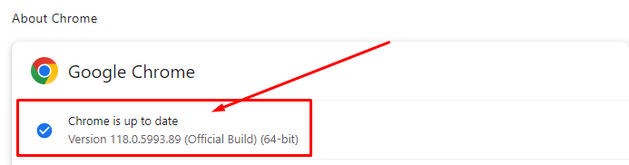
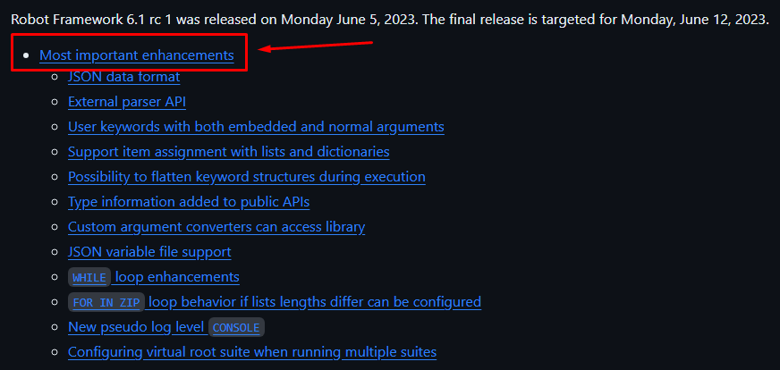

### Curso de Robot Framework Avançado

* [X] Validar versões das Librarys [ pip freeze ] lista todas as librarys e suas versões
* [X] Consulta das versões atualizadas
* [X] Atualizar [ pip install -u library-escolhida ]
* [X] Atualizar Web-Drivers para testes WEB :

  * [ https://googlechromelabs.github.io/chrome-for-testing/ ]

  
* [X] Confrontar com a versão que tenho no Google da Máquina

- Na tela do Google > Lado superior direito 3 pontinhos > help > About Google Chrome

  

- [X] Deixar o webdriver baixado dentro do VS Code

  - Baixar o GeckoDriver versão para firefox :

    [ https://github.com/mozilla/geckodriver/releases ]
- [X] Para Executar os Testes : [ robot -d ./logs .\pasta-escolhida ]
- [X] Loops
- [X] Tear Down
- [X] Falhas Previstas
- [X] Argumentos
- [X] Esperas

* ##### **Libraries Auxiliares**

  * [X] [BuiltIn](https://robotframework.org/robotframework/#standard-libraries)  - coleção de funções e tipos de dados incorporados ao Python.Inclui coisascomo `print()`, `len()`, `int()`, etc.
  * [X] [Date Time](http://robotframework.org/robotframework/latest/libraries/DateTime.html) - usada para lidar com operações relacionadas a datas e horários.Elapermite a criação, manipulação e formatação de objetos de data e hora.
  * [X] [Operating System](http://robotframework.org/robotframework/latest/libraries/OperatingSystem.html) - pode ser usada para manipular arquivos, pastas, executarcomandos do sistema, entre outras operações relacionadas ao sistema operacional.
  * [X] [String](http://robotframework.org/robotframework/latest/libraries/String.html) - ela permite operações como concatenação, busca, substituição e formatação de strings.
  * [X] [Process](http://robotframework.org/robotframework/latest/libraries/Process.html) - usada para criar processos paralelos e concorrentes em Python, aproveitando melhor recursos de CPU.
  * [X] [DataBase ](https://docs.robotframework.org/docs/different_libraries/database) - é uma library externa então precisa ser instalada, e facilita a automação de testes que envolvem interações com bancos dedados, contribuindo para a qualidade e confiabilidade do seu software.
    Para instalar executar o comando: [ pip install -U robotframework-databaselibrary ]
  * [X] [DiffLibrary](https://marketsquare.github.io/robotframework-difflibrary/)
  * [X] **Instalação do PostgreSQL**

    Baixando um cliente de Banco de Dados

    Nesta aula vamos usar o PostgreSQL, mas se você já tiver algum outro servidor/cliente de Banco de Dados instalado que queira usar, fique a vontade!!! A única coisa que vai mudar é a forma de conexão com esse banco, mas isso será explicado na aula sobre DatabaseLibrary, pois a DatabaseLibrary deve se conectar com a maioria dos Banco de Dados existentes!!!

    Se você deseja utilizar o da aula, segue o passo-a-passo:

    01 - Baixe e instale o Banco de Dados (PostgreSQL) conforme o seu S.O.

    - https://www.postgresql.org/download/
    - Para Windows, pode ser a versão postgresql-12.0-1-windows-x64.exe (anexo nesta aula)

    02 - Acesse o PGAdmin para gerenciar o Banco de Dados

    - (Windows) Menu Iniciar -> pgAdmin4

    OBS.: Para ver os aplicativos e configurações instaladas (Windows)

    - C:\ProgramData\Microsoft\Windows\Start Menu\Programs\PostgreSQL 12
    - C:\Program Files\PostgreSQL\12\data

    03 - Para o Python (que roda abaixo do Robot) conseguir se comunicar com o PostgreSQL, vamos utilizar o driver psycopg2, para isso precisamos instalá-lo também:

    - Documentação: https://pypi.org/project/psycopg2/
    - pip install psycopg2

    04 - Pronto! Agora é só aguardar a aula sobre a library DatabaseLibrary para ver como o Robot irá interagir com o Banco de Dados!
  * [X] *********Libraries *** -  Menções Honrosas**

    **XML**

  Para manipulação e conferências de arquivos em formato XML.

  **Saiba mais:** [https://robotizandotestes.blogspot.com/2019/07/season-libraries-ep-06-library-xml.html](https://robotizandotestes.blogspot.com/2019/07/season-libraries-ep-06-library-xml.html)

  ExcelRobot

  Para manipulação e conferências de planilhas EXCEL.

  **Saiba mais: **[https://github.com/zero-88/robotframework-excel](https://github.com/zero-88/robotframework-excel)

  Faker

  Para geração de massa de dados *fakes *para os testes.

  **Saiba mais:  **[https://robotizandotestes.blogspot.com/2018/01/season-libraries-ep-01-library-faker.html](https://robotizandotestes.blogspot.com/2018/01/season-libraries-ep-01-library-faker.html)

  ImapLibrary

  Para manipulação e conferências de e-mails, via conexão com o provedor de e-mail.

  **Saiba mais: **[https://github.com/rickypc/robotframework-imaplibrary](https://github.com/rickypc/robotframework-imaplibrary)

  SSHLibrary

  Para comunicação com máquinas Linux via SSH durante um teste.

  **Saiba mais: **[http://robotframework.org/SSHLibrary/SSHLibrary.html](http://robotframework.org/SSHLibrary/SSHLibrary.html)

  #### ***E não acaba por aqui...***

  Veja mais *libraries *úteis em [https://robotframework.org/#libraries](https://robotframework.org/#libraries)!!!

  E não se esqueça de que pode pesquisar uma *library *em [https://pypi.org/](https://pypi.org/) ou no **Google Pesquisa** digitando na busca por " *robot framework* ", exemplo " *excel robot framework* "!
* ** Libraries Customizadas**
* ** Web Testing Avançado**
* ** API Testing Avançado**
* ** Execução do Docker**
* ** Integração Contínua**
* ** Links Úteis**

##### * [ ] **Tarefa 01**

Acesse a documentação da library DiffLibrary [doc-DiffLibrary](https://github.com/MarketSquare/robotframework-difflibrary) e [Repo-DiffLibrary](https://marketsquare.github.io/robotframework-difflibrary/) e crie um teste que utilize ela!

##### **Como verificar as novidades das novas versões do ROBOT-FRAMEWORK**

    [GitHub Robot-framework](https://github.com/robotframework/robotframework)

- Pasta doc > releasenotes > versão atual
- rc = release candidate = versão ainda em teste
- Melhorias adicionadas da nova versão

### Conteúdo do Curso

* **Controle de fluxos mais avançados para testes mais complexos**
* **Comunicação com banco de dados**
* **Manipulação de strings, datas, sistema de arquivos e processos do S.O.**
* **Criação de library customizada e manutenção em libraries públicas**
* **Automação WEB: Page Objects e execução Headless**
* **Automação API: Trabalhar com Headers, Parâmetros e Autenticação**
* **Automação API: Templates e navegação avançada em JSON**
* **Execução em containers Docker**
* **Execução em integração contínua CI**
